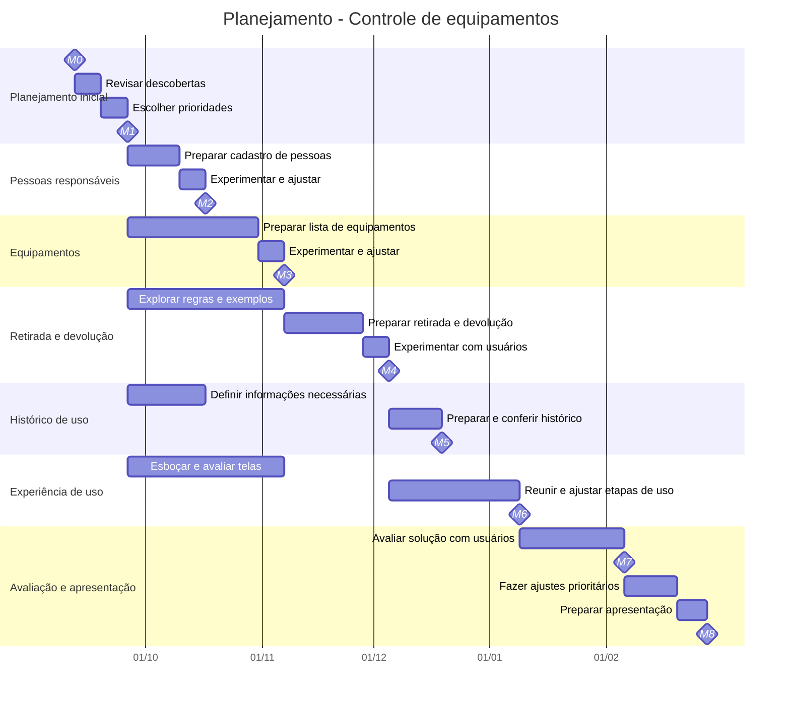
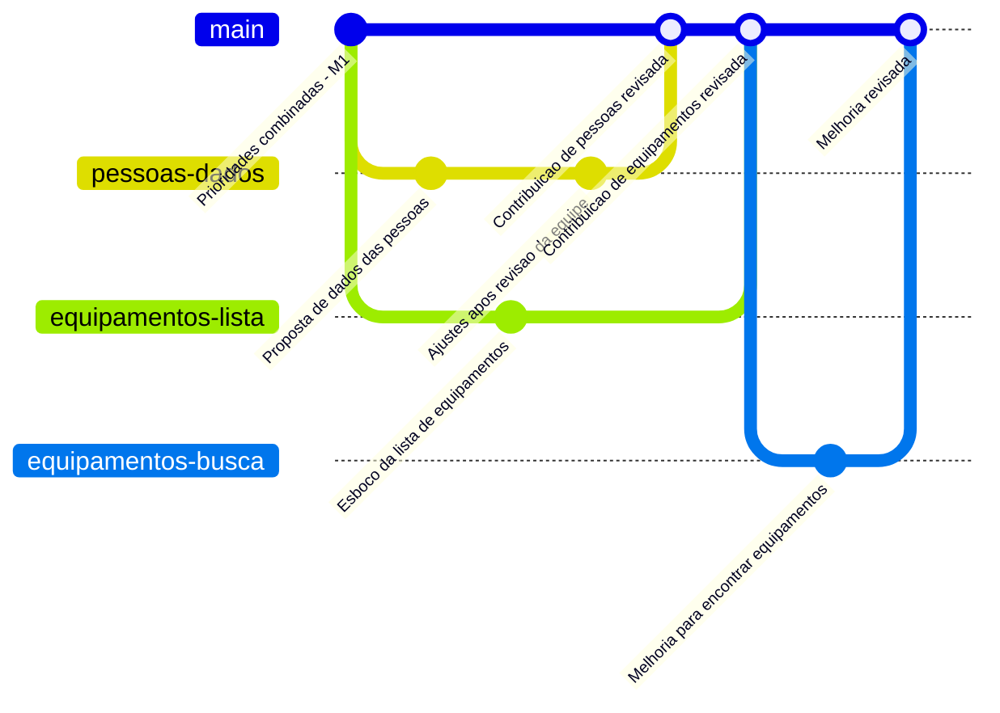

# Planejamento e colaboração — controle de equipamentos

Este exemplo parte do fim do **discovery**, etapa em que a equipe investigou o problema e as necessidades das pessoas. A proposta inicial é ajudar uma organização a saber **quais equipamentos possui, com quem estão e quando foram devolvidos**.

O planejamento abaixo é uma hipótese de trabalho. As funcionalidades e as datas devem ser revistas conforme a equipe aprende com os usuários. Neste momento, basta combinar o que se pretende entregar e como verificar se isso atende à necessidade identificada.

## Cronograma de entregas

Período do exemplo: **12/09/2026 a 28/02/2027**, em dias corridos. Ao adaptar para a turma, considerem a disponibilidade da equipe, os feriados e o recesso escolar.

As seções representam **frentes de trabalho**. O Gantt ajuda a visualizar o que pode acontecer ao mesmo tempo e o que depende de outra entrega. Os losangos **M0–M8** representam marcos importantes; a legenda fica abaixo do gráfico.

### Legenda dos marcos — milestones

Um **marco** é um ponto de verificação, como uma decisão tomada ou uma entrega demonstrada. Ele não ocupa um período de trabalho: registra um resultado que a equipe precisa conferir.

| Marco | Data prevista | Resultado esperado |
| --- | --- | --- |
| **M0** | 12/09/2026 | Início do planejamento após o discovery. |
| **M1** | 26/09/2026 | Equipe combina as prioridades e o objetivo da primeira versão. |
| **M2** | 17/10/2026 | É possível cadastrar e consultar uma pessoa responsável. |
| **M3** | 07/11/2026 | É possível registrar e encontrar um equipamento. |
| **M4** | 05/12/2026 | É possível registrar quem retirou um equipamento e sua devolução. |
| **M5** | 19/12/2026 | É possível consultar o histórico de uso de um equipamento. |
| **M6** | 09/01/2027 | O usuário consegue percorrer as etapas principais da solução. |
| **M7** | 06/02/2027 | A equipe avalia os resultados com usuários e decide os ajustes prioritários. |
| **M8** | 28/02/2027 | A equipe apresenta a versão construída e os aprendizados do projeto. |

### Como interpretar o planejamento

- **Trabalho paralelo:** após M1, parte da equipe pode cuidar das pessoas, outra dos equipamentos e outra explorar as telas. Isso depende da quantidade de integrantes e do tempo disponível.
- **Dependência:** para demonstrar uma retirada completa em M4, é preciso ter uma pessoa e um equipamento registrados. Enquanto isso, a equipe pode discutir as regras usando exemplos e desenhos.
- **Divisão do trabalho:** cada frente precisa ter um resultado claro e combinar com as demais quais informações serão necessárias. Assim, uma equipe consegue avançar sem esperar que tudo esteja pronto.
- **Validação frequente:** mostrem pequenas entregas durante o trabalho. Os marcos são pontos de referência, não as únicas oportunidades de ouvir usuários.

As barras mais longas agrupam várias atividades pequenas. Por exemplo, “Esboçar e avaliar telas” pode incluir desenhar uma tela, mostrar a alguém, registrar dificuldades e melhorar o desenho. A equipe deve detalhar primeiro o trabalho mais próximo e refinar o restante ao longo do projeto.

## Do cronograma às tarefas da equipe

Uma tarefa deve ser pequena o suficiente para ser acompanhada e ter uma forma simples de verificar sua conclusão.

| Frente | Exemplo de tarefa pequena | Como saber se foi concluída? |
| --- | --- | --- |
| Pessoas responsáveis | Definir os dados necessários para identificar uma pessoa. | A equipe consegue explicar por que cada dado é necessário. |
| Equipamentos | Esboçar a lista de equipamentos. | Um usuário consegue encontrar um item no esboço. |
| Retirada e devolução | Descrever um exemplo de retirada. | Estão claros a pessoa responsável, o equipamento e a data. |
| Histórico de uso | Escolher quais informações aparecem no histórico. | Um usuário consegue entender com quem o equipamento esteve. |
| Experiência de uso | Avaliar o caminho para registrar uma devolução. | A equipe observa as dificuldades e registra melhorias. |

Para acompanhar essas tarefas, usem um quadro com **A fazer → Em andamento → Em revisão → Concluído**. Registrem um responsável por cada tarefa e evitem começar mais atividades do que a equipe consegue acompanhar.

## GitGraph — como colaborar nas entregas

O Gantt mostra **quando e por que trabalhar em cada entrega**. O GitGraph mostra **como reunir as contribuições da equipe**. Ele pode representar alterações em documentos, desenhos de telas e, quando chegar o momento, código.

- **`main`:** versão compartilhada do trabalho já revisado.
- **Branch (ramo):** espaço separado para realizar uma tarefa.
- **Commit:** registro de uma alteração.
- **Pull request (PR):** pedido para outra pessoa revisar a contribuição.
- **Merge:** incorporação da contribuição à versão compartilhada.

O exemplo abaixo mostra duas tarefas realizadas em paralelo após M1 e uma melhoria posterior. Os nomes dos ramos identificam a frente e a tarefa.

O GitGraph apresenta uma sequência de alterações, **sem escala de datas**. Concluir esses ramos ajuda a avançar nas frentes de pessoas e equipamentos, mas não significa que M2 e M3 já foram alcançados: esses marcos exigem os resultados descritos na legenda.

### Combinados simples para Git e GitHub

1. **Registrem a tarefa:** no GitHub, uma *issue* pode guardar a descrição, o responsável e o resultado esperado. Associem as tarefas ao marco que ajudam a alcançar.
2. **Criem um ramo por tarefa:** usem nomes como `pessoas-dados` ou `equipamentos-lista`, partindo da versão atualizada da `main`. Uma frente terá vários ramos ao longo do projeto.
3. **Peçam revisão:** ao terminar uma pequena contribuição, abram um PR e expliquem o que mudou. Outro integrante confere se a tarefa atingiu o resultado combinado.
4. **Reúnam o trabalho com frequência:** depois da revisão, incorporem a contribuição à `main` e encerrem o ramo. Não esperem o fim do projeto para juntar tudo.
5. **Confiram os marcos:** demonstrem o resultado previsto na legenda. No GitHub, um *milestone* agrupa as tarefas relacionadas a esse marco.

Uma branch acompanha uma tarefa, não uma pessoa nem toda a duração de uma frente. Mesmo que “Equipamentos” ocupe várias semanas no Gantt, suas contribuições devem ser pequenas e revisadas ao longo do período.

## Atividade para a turma

Com base no que descobriram sobre o problema, discutam:

1. Qual é a menor entrega que já ajudaria o usuário?
2. Quais resultados precisam ser demonstrados nos primeiros marcos?
3. O que pode acontecer em paralelo e o que precisa esperar outra entrega?
4. Qual incerteza pode mudar o planejamento? Como investigá-la cedo?
5. O que a equipe consegue concluir no próximo ciclo de uma ou duas semanas?

Ao final de cada ciclo, revejam o que foi aprendido e ajustem as próximas tarefas. O cronograma orienta a conversa; novas evidências podem mudar prioridades, escopo e previsões de entrega.
